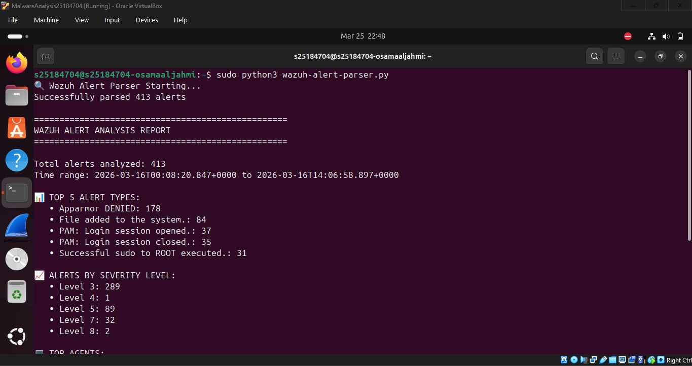
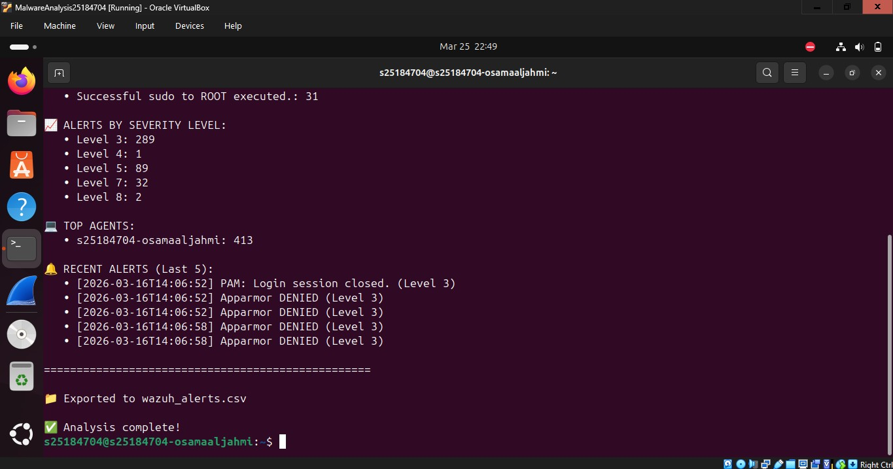

# Wazuh Alert Log Parser

A Python script to parse Wazuh SIEM alerts and generate security event reports from real alerts.

## 📊 Sample Output

From 413 alerts generated during Wazuh deployment:


==================================================
WAZUH ALERT ANALYSIS REPORT
==================================================
How It Works

1. Reads Wazuh `alerts.json` file
2. Parses each JSON alert
3. Extracts timestamp, rule ID, description, severity level
4. Generates summary report with top alert types

## Usage

```bash
sudo python3 wazuh-alert-parser.py
